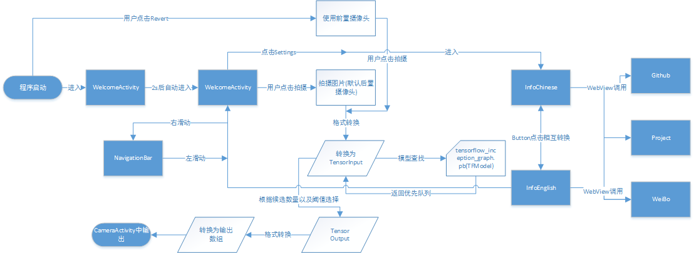
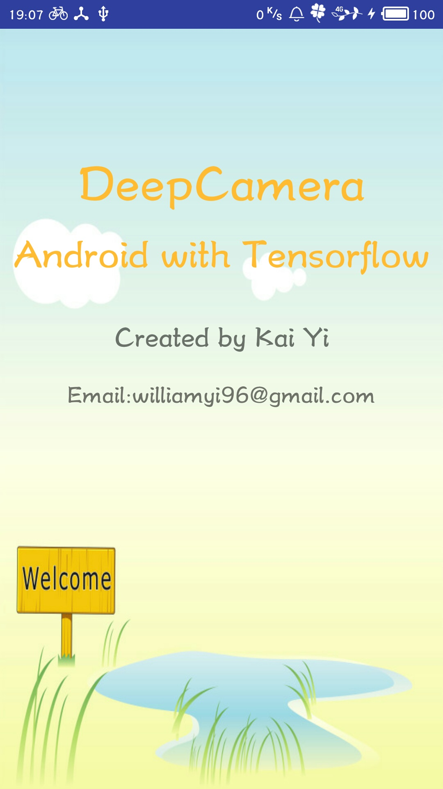
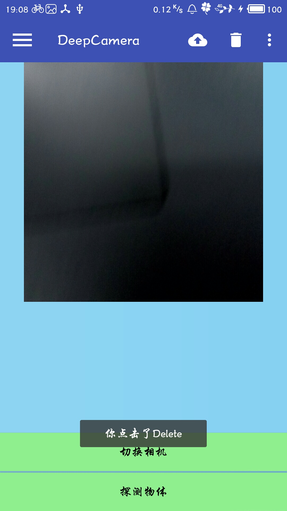
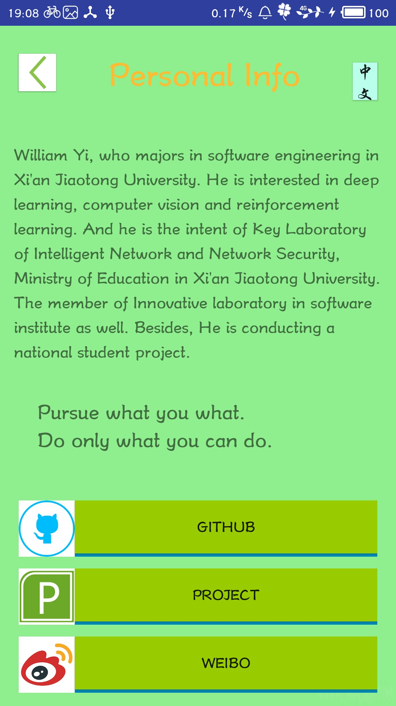
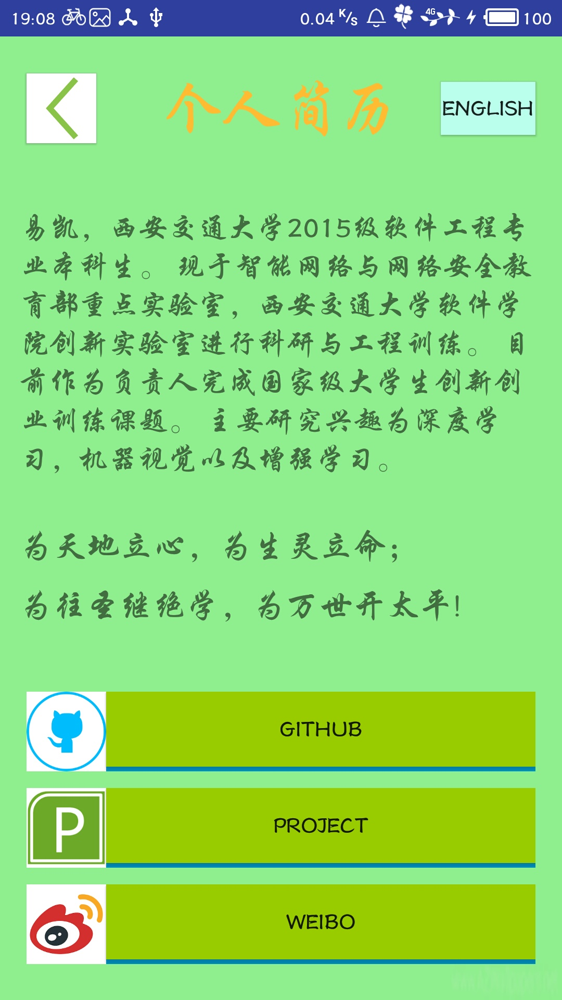
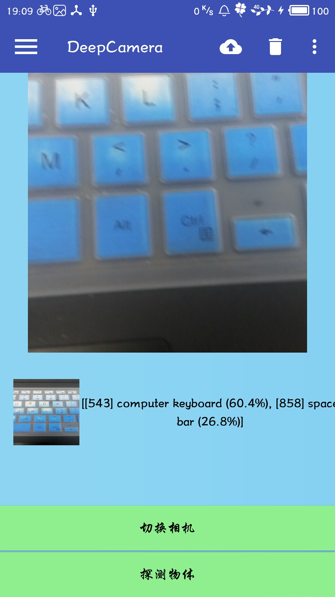
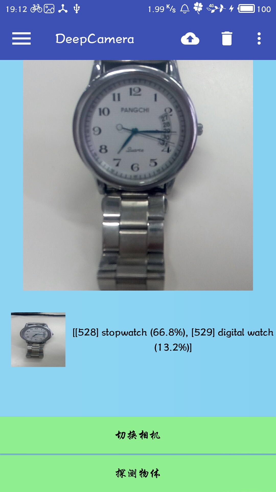
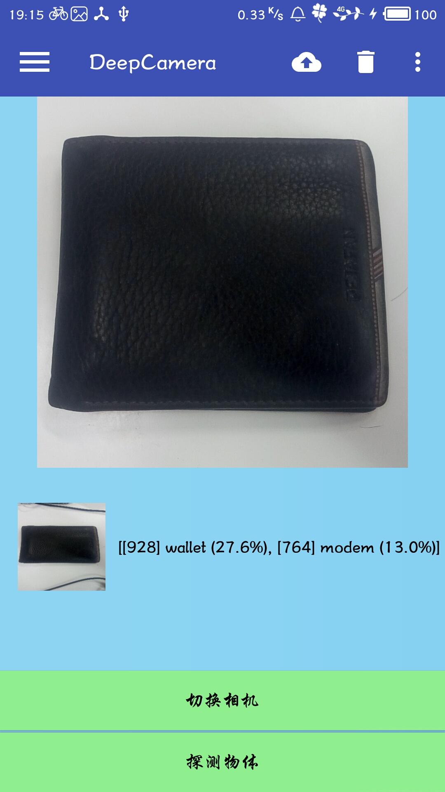
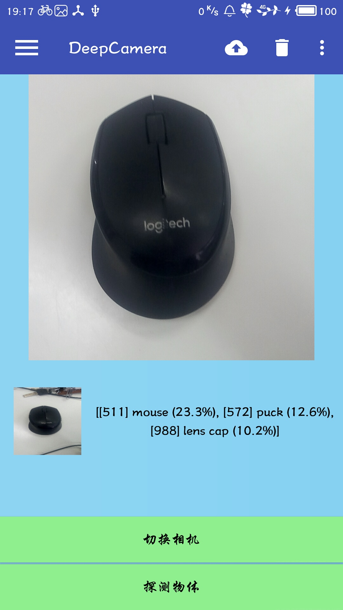
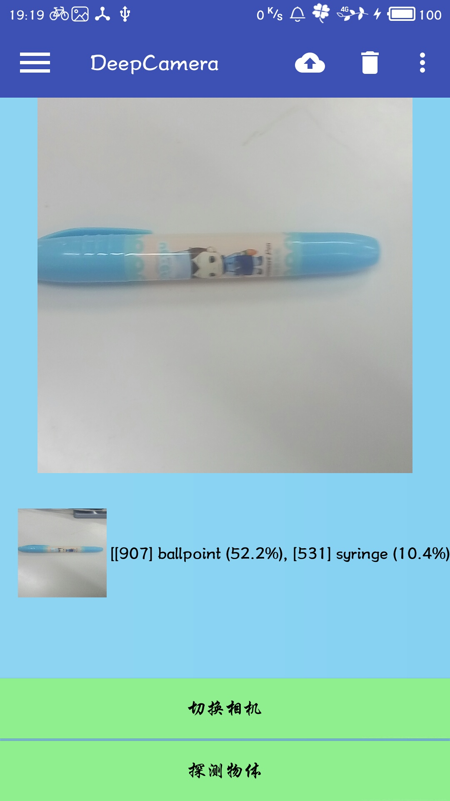

# 内容说明

该项目是西安交通大学2015级软件工程系本科生以《嵌入式软件设计与安卓综合实验》设计为契机进行的《Android-Machine Learning: DeepCamera》的设计与实现。所有工作均主要由本人完成。项目设计与实现过程中，严格采取工程模块化的设计思想，务必追求严谨，考虑周全。经过接近一个月的设计与实现，最终于2017年6月末完成整体设计，并完成所有相关代码以及样例运行。

关于该实验的相关程序以及发布在GitHub上，读者可以下载学习共同探讨心得，

# 基本介绍

出于实际需要，实验研究背景部分进行简要说明。

由于android相对而言操作性更强，因此以下说明内容更多地放在machine learning之上。

从2012年来，以深度学习(其核心为卷积神经网络CNN和循环神经网络RNN)为代表的机器学习引起了极大的轰动性。由于卷积神经网络与循环神经网络自身的特性，能够大大地提升各个领域的效率，其得到的结果相当惊艳，机器学习已经被应用于自然语言处理，机器视觉，语音识别，甚至是不对称信息博弈(代表为AlphaGo与德州扑克)。

TensorFlow是google于2015年推出的机器学习平台，一经推出，即引起了很大反响，大大提升了机器学习实践的效率，如何该项目在GitHub上的star数已经超过了6W，成为了机器学习框架中的姣姣者。

一直以来，目标识别(object detection)就是一个十分棘手的问题，没有任何或者少量先验知识进行物体识别的难度可想而知。而当前，为了有效地提升目标识别的准确度，学者们提出了各种各样的解决方案。

在这种大背景之下，萌生了将两者进行有机结合来设计制作APP的想法。

# 总体流程图

# 模块展示

  

  

# 测试展示

